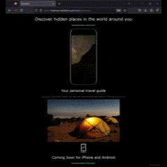

# Codecademy Project: Excursion

## Description
### General Description and Motivation
The importance of this project has more to do with my learning goals than the product itself. I undertook the project as part of Codecademy's course on Git/GitHub. I wanted to learn Git and GitHub for two reason: to post past and future projects in a public setting as I grow my portfolio, as well as to display that I know how to use Git. I believe that prior familiarity with Git will be useful when I take my first software engineering role.

### Problems Solved by this Project and What I Learned
This project does not solve any functional, real-world problem. For me personally, however, this project and the course it was set in solved a few problems:
* I learned the basic Git workflow and Git commands
* I learned how to use Git with a remote repository hosted on GitHub
* I learned Markdown
* I learned best practices for a README file.
* I gained more exposure to HTML and CSS; two technologies which I've only been able to explore through a CMS in the past.
* I took this Codecademy course specifically to learn Git and GitHub. However, the project was apparently designed to be part of their web development career track. It assumed I already had much more knowledge of HTML and CSS than I actually did. As a result, I got to learn a number of things through Google.

### Future Work
Naturally I'm left with more questions than answers after finishing this project, and as a scientist I can't help but discuss areas for future work. In the future, I still need to:
* Work on a collaborative project. Using `>> git fetch` was a rather uninspiring process knowing that nobody had pushed changes to the remote repository while I was working.
* Learn more about mobile-first design. I can't say without the full context of the coursework that Codeacademy (falsely) assumed I had completed before beginning this project, but I assume they intended for this to be a desktop-based web project. I finished the project and everything was acceptable in my laptop's browser. However, I later noticed that the site did not display properly on my mobile phone. Unfortunately, it's outside the scope of my current goals to go back and fix that issue, but I acknowledge it and would like to return to fix it in the future when it's more directly related to my learning goals.
* Take better screen recordings... ShareX was recommended for capturing/exporting recordings as .gifs, but the quality is bad. When it's important, I'll need to make sure any media is legible.

## Features

How to Use:
Using a desktop, or a mobile browser set to "Display Desktop Site," navigate [here](https://highway-kebabbery.github.io/excursion/)

## Technologies
* HTML: Provides web page structure
* CSS: Provides styling

## Collaborators
Not applicable. I wouldn't include a blank section like this under normal circumstances, but I'm currently learning to write a README.